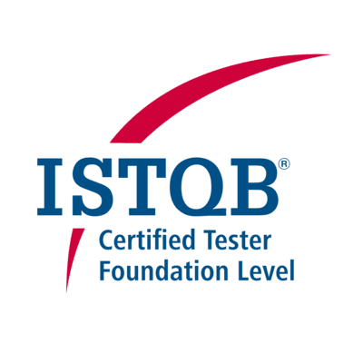
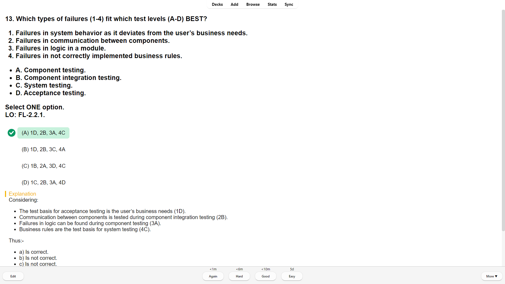

# ISTQB CTFL (4.0)

<!-- PROJECT LOGO -->

    

  <h3 align="center">ISTQB CTFL Mock Exams</h3>

  

    The ISTQB® Certified Tester Foundation Level 4.0 (CTFL 4.0) aims to empower testers to become key players in agile transformation with a shift-left approach that places testing at the forefront of quality and value delivery.
     
    <a href="https://www.istqb.org/certifications/certified-tester-foundation-level"><strong>Official Website »</strong></a>
  

<!-- SCREENSHOT -->
## Screenshot

<kbd></kbd>

<!-- LICENSE -->
## License

Distributed under the CC0 1.0 Universal License. See `LICENSE` for more information.

<!-- AUTHOR -->
## Author

Syafiq Hadzir - <syafiqhadzir@live.com.my>
